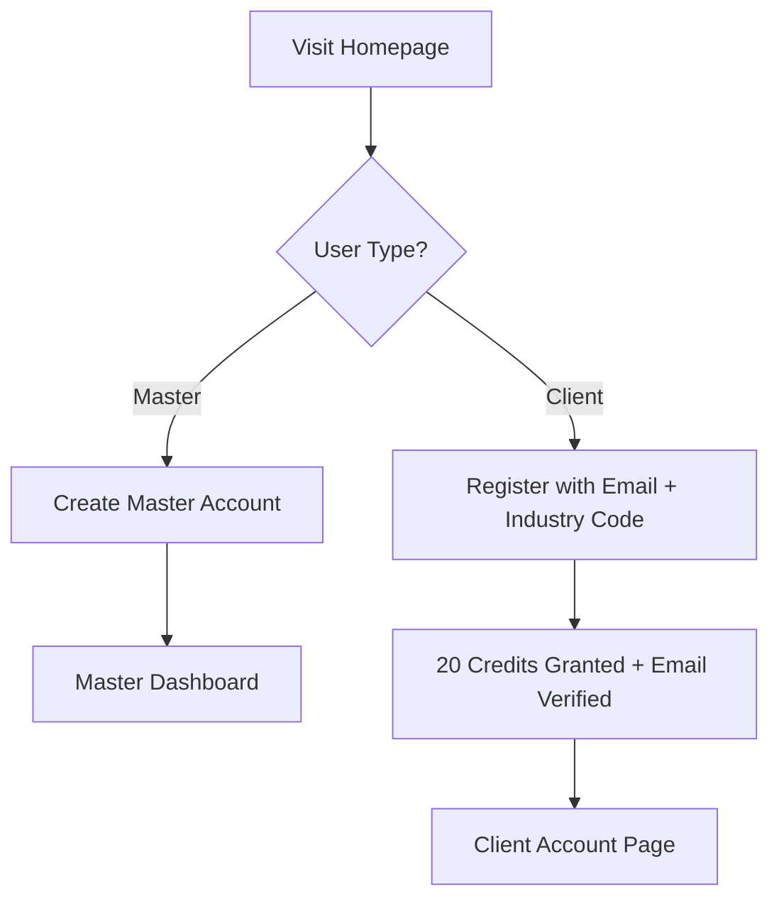
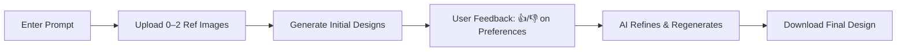

# 🎨 AI Design Generator

[remote content]
<image-card alt="AI Design Generator Demo" src="assets/screenshot.png" ></image-card>
**Visualize your ideas in seconds with AI-powered design generation!**

🌐 **Live Demo**: [AI Design Generator](https://chachak410.github.io/ai-design-generator/)  
📂 **Repository**: [GitHub](https://github.com/chachak410/ai-design-generator)  
[<image-card alt="License: MIT" src="https://img.shields.io/badge/License-MIT-yellow.svg" ></image-card>](https://opensource.org/licenses/MIT)

## 📖 About

The **AI Design Generator** is a lightweight, browser-based tool that transforms your ideas into stunning design layouts, copy, and visual cues in seconds. Whether you're a designer, marketer, or business owner, this tool helps you create and iterate on designs effortlessly. Powered by AI, it generates customizable templates tailored to your industry, with **bilingual (English/中文) support** and enhanced user flow for both **Master Admins** and **Clients**.

---

## ✨ Features

- **Instant AI Design Generation**: Enter a text prompt to generate layouts, copy, and visuals.
- **Image Generation with Feedback Loop**: Generate images using **2 reference images** + **user preference feedback** for refined results.
- **Customizable Industry Templates**: Pre-built templates managed by Master Admins.
- **Bilingual Interface**: Full support for **English and Chinese (Simplified)**.
- **Credit-Based System**: New users receive **20 credits** upon registration.
- **Shared Template & History Access**: Clients and Masters can view templates and past design records.
- **Download & Share**: Save or export designs instantly.
- **Responsive Design**: Optimized for desktop and mobile.

---

## 🏗️ New Architecture & Page Flow

| Role       | Entry Point                  | Key Pages                              |
|------------|------------------------------|----------------------------------------|
| **Master** | `Create Account Page`        | → Dashboard → Template Management → Client Management |
| **Client** | `Account Page` (via code)    | → Design Studio → Past Records → Profile |

> **Removed**: Setup Page (now integrated into Master onboarding)

---

## 🚀 Getting Started

### For **Clients**
1. Go to the [AI Design Generator](https://chachak410.github.io/ai-design-generator/).
2. **Register** with:
   - Email
   - **Industry Code** (provided by your Master Admin)
   - Receive **20 free credits**
3. Log in to your **Account Page**.
4. Browse **shared templates** and **past records**.
5. Enter your design prompt (e.g., *"现代科技初创公司首页设计"* or *"Modern landing page for a fintech app"*).
6. Upload **up to 2 reference images** (optional).
7. Click **Generate** → Review results → Give **preference feedback** (like/dislike) to refine.
8. Download or save your final design.

> Language automatically detected or manually switched (EN / 中文)

---

### For **Master Admins**
1. Visit the app and select **"Create Master Account"**.
2. Set up your organization and generate **unique industry codes**.
3. Access the **Master Dashboard** to:
   - Upload and manage **industry-specific templates**
   - Assign codes and credits to clients
   - View all **past records** across users
4. (Optional) Integrate [EmailJS](https://www.emailjs.com/) for:
   - Verification emails
   - Password reset
   - Code delivery

> **Note**: Master accounts have full control over templates and client access.

---

### Registration Flow (All Users)


---

### Image Generation Flow


---

## 🌐 Bilingual Support

- Interface available in **English** and **中文 (简体)**
- Auto-detects browser language
- Manual toggle in header
- All prompts, templates, and UI elements fully translated

---

## 🔧 Running Locally (For Developers)

1. Clone the repository:
   ```bash
   git clone https://github.com/chachak410/ai-design-generator.git
   cd ai-design-generator
   ```

2. Install dependencies:
   ```bash
   npm install
   ```

3. Set up environment variables (`.env`):
   ```env
   VITE_EMAILJS_SERVICE_ID=your_service_id
   VITE_EMAILJS_TEMPLATE_ID=your_template_id
   VITE_EMAILJS_PUBLIC_KEY=your_public_key
   ```

4. Start the dev server:
   ```bash
   npm run dev
   ```

5. Open [http://localhost:5173](http://localhost:5173)

---

## 📬 Email Integration (Optional but Recommended)

Use [EmailJS](https://www.emailjs.com/) to enable:
- Account verification
- Industry code delivery
- Password reset

> Store keys securely — never commit to GitHub.

---

## 🤝 Contributing

We welcome contributions! See [CONTRIBUTING.md](CONTRIBUTING.md) for details.

---

## ⚖️ License

This project is licensed under the **MIT License** — see [LICENSE](LICENSE) for details.

---

**Built with 💡 by designers, for creators.**  
*Turn ideas into visuals — instantly, intelligently, in any language.*
